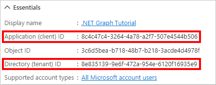

<!-- markdownlint-disable MD041 -->

In this exercise you will register a new application in Azure Active Directory to enable [user authentication](/graph/auth-v2-user). You can register an application using the Azure Active Directory admin center, or by using the [Microsoft Graph PowerShell SDK](/graph/powershell/get-started).

Optionally, you will also update the app registration to support [app-only authentication](/graph/auth-v2-service). This step will require access to a **Work or School Account** with the **Global administrator** role.

## Register application for user authentication

In this section you will register an application that will support user authentication using [device code flow](/azure/active-directory/develop/v2-oauth2-device-code).

### [Azure AD admin center](#tab/aad)

1. Open a browser and navigate to the [Azure Active Directory admin center](https://aad.portal.azure.com) and login using a **personal account** (aka: Microsoft Account) or **Work or School Account**.

1. Select **Azure Active Directory** in the left-hand navigation, then select **App registrations** under **Manage**.

    

1. Select **New registration**. Enter a name for your application, for example, `.NET Graph Tutorial`.

1. Set **Supported account types** as desired. The options are:

    | Option | Who can sign in? |
    |--------|------------------|
    | **Accounts in this organizational directory only** | Only users in your Microsoft 365 organization |
    | **Accounts in any organizational directory** | Users in any Microsoft 365 organization (work or school accounts) |
    | **Accounts in any organizational directory ... and personal Microsoft accounts** | Users in any Microsoft 365 organization (work or school accounts) and personal Microsoft accounts |

1. Leave **Redirect URI** empty.

1. Select **Register**. On the application's **Overview** page, copy the value of the **Application (client) ID** and save it, you will need it in the next step. If you chose **Accounts in this organizational directory only** for **Supported account types**, also copy the **Directory (tenant) ID** and save it.

    

1. Select **Authentication** under **Manage**. Locate the **Advanced settings** section and change the **Allow public client flows** toggle to **Yes**, then choose **Save**.

    

### [PowerShell](#tab/powershell)

To use PowerShell, you'll need the Microsoft Graph PowerShell SDK. If you do not have it, see [Install the Microsoft Graph PowerShell SDK](/graph/powershell/installation) for installation instructions.

> [!IMPORTANT]
> The PowerShell script requires a work/school account with the Application administrator, Cloud application administrator, or Global administrator role. If your account has the Application developer role, you can register in the Azure AD admin center.

1. Create a new file named **RegisterAppForUserAuth.ps1** and add the following code.

    :::code language="powershell" source="./src/demo/RegisterAppForUserAuth.ps1" id="ScriptBody":::

1. Save the file.

1. Open PowerShell and change the current directory to the location of **RegisterAppForUserAuth.ps1**.

1. Run the following command, replacing *&lt;audience-value&gt;* with the desired value (see table below).

    ```powershell
    .\RegisterAppForUserAuth.ps1 -AppName ".NET Graph Tutorial" -SignInAudience <audience-value>
    ```

    | SignInAudience value | Who can sign in? |
    |----------------------|------------------|
    | `AzureADMyOrg` | Only users in your Microsoft 365 organization |
    | `AzureADMultipleOrgs` | Users in any Microsoft 365 organization (work or school accounts) |
    | `AzureADandPersonalMicrosoftAccount` | Users in any Microsoft 365 organization (work or school accounts) and personal Microsoft accounts |
    | `PersonalMicrosoftAccount` | Only personal Microsoft accounts |

1. Follow the prompt to open `https://microsoft.com/devicelogin` in a browser, enter the provided code, and complete the authentication process.

1. Copy the **Client ID** and **Auth tenant** values from the script output. You will need these values in the next step.

    ```powershell
    SUCCESS
    Client ID: 2fb1652f-a9a0-4db9-b220-b224b8d9d38b
    Auth tenant: common
    ```

---

> [!NOTE]
> Notice that you did not configure any Microsoft Graph permissions on the app registration. This is because the sample will use [dynamic consent](/azure/active-directory/develop/v2-permissions-and-consent#incremental-and-dynamic-user-consent) to request specific permissions for user authentication.
