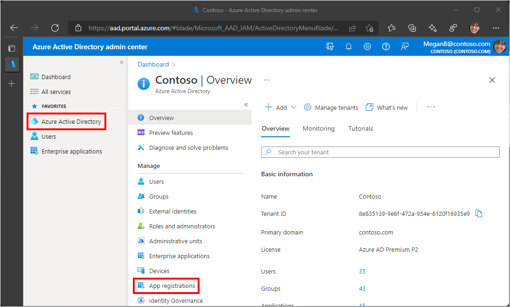

<!-- markdownlint-disable MD041 MD051 -->

In this exercise you will register a new application in Azure Active Directory to enable [app-only authentication](/graph/auth-v2-service).

## Create a self-signed certificate

The Microsoft Graph PowerShell SDK requires a certificate for app-only authentication. For development purposes, a self-signed certificate is sufficient. You need a certificate with the private key installed on the local machine, and the public key exported in a .CER, .PEM, or .CRT file.

### [Windows](#tab/windows)

On Windows, you can use the [pki PowerShell module](/powershell/module/pki) to generate the certificate.

```powershell
$cert = New-SelfSignedCertificate -Subject "CN=PowerShell App-Only" -CertStoreLocation `
  "Cert:\CurrentUser\My" -KeyExportPolicy Exportable -KeySpec Signature -KeyLength 2048 `
  -KeyAlgorithm RSA -HashAlgorithm SHA256
Export-Certificate -Cert $cert -FilePath "./PowerShellAppOnly.cer"
```

### [Linux/MacOS](#tab/linux-macos)

On Linux or MacOS, you can use [OpenSSL](https://www.openssl.org/) to generate the private and public keys, then use PowerShell to install the private key into a certificate store readable by PowerShell.

1. Generate a new X509 certificate using the following command.

    ```bash
    openssl req -x509 -newkey rsa:2048 -sha256 -days 365 -keyout powershell.pem -out powershell.crt -subj "/CN=PowerShell App-Only"
    ```

1. OpenSSL prompts you for a PEM pass phrase. Enter a pass phrase you will remember.

1. Create a PFX file using the following command.

    ```bash
    openssl pkcs12 -export -out powershell.pfx -inkey powershell.pem -in powershell.crt
    ```

1. OpenSSL prompts you for the pass phrase for **powershell.pem**, enter the pass phrase you used in the previous step.

1. OpenSSL prompts you for an export password. Enter a password you will remember.

1. Open PowerShell and run the following commands, replacing *&lt;export-password&gt;* with the export password you used in the previous step.

    ```powershell
    using namespace System.Security.Cryptography.X509Certificates
    $store = [X509Store]::new('My', 'CurrentUser', 'ReadWrite')
    $store.Add([X509Certificate2]::new('./powershell.pfx', '<export-password>', [X509KeyStorageFlags]::PersistKeyS
    et))
    $store.Dispose()
    ```

---

## Register application for app-only authentication

In this section you will register an application that will support app-only authentication using [client credentials flow](/azure/active-directory/develop/v2-oauth2-client-creds-grant-flow).

1. Open a browser and navigate to the [Azure Active Directory admin center](https://aad.portal.azure.com) and login using a Global administrator account.

1. Select **Azure Active Directory** in the left-hand navigation, then select **App registrations** under **Manage**.

    

1. Select **New registration**. Enter a name for your application, for example, `PowerShell Graph Tutorial`.

1. Set **Supported account types** to **Accounts in this organizational directory only**.

1. Leave **Redirect URI** empty.

1. Select **Register**. On the application's **Overview** page, copy the value of the **Application (client) ID** and **Directory (tenant) ID** and save them, you will need these values in the next step.

    

1. Select **API permissions** under **Manage**.

1. Remove the default **User.Read** permission under **Configured permissions** by selecting the ellipses (**...**) in its row and selecting **Remove permission**.

1. Select **Add a permission**, then **Microsoft Graph**.

1. Select **Application permissions**.

1. Select **User.Read.All**, then select **Add permissions**.

1. Select **Grant admin consent for...**, then select **Yes** to provide admin consent for the selected permission.

    

1. Select **Certificates and secrets** under **Manage**, then select **Certificates**.

1. Select **Upload certificate**. Upload the **PowerShellAppOnly.cer** or **powershell.crt** file you created in the previous step, then select **Add**.

> [!NOTE]
> Notice that, unlike the steps when registering for user authentication, in this section you did configure Microsoft Graph permissions on the app registration. This is because app-only auth uses the [client credentials flow](/azure/active-directory/develop/v2-oauth2-client-creds-grant-flow), which requires that permissions be configured on the app registration. See [The .default scope](/azure/active-directory/develop/v2-permissions-and-consent#the-default-scope) for details.
