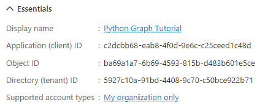

<!-- markdownlint-disable MD041 MD051 -->

In this exercise you will register a new application in Azure Active Directory to enable [app-only authentication](/graph/auth-v2-service). You can register an application using the Azure Active Directory admin center, or by using the [Microsoft Graph PowerShell SDK](/graph/powershell/get-started).

[!INCLUDE [preview-disclaimer](../preview-disclaimer.md)]

## Register application for app-only authentication

In this section you will register an application that will support user authentication using [client credentials flow](/azure/active-directory/develop/v2-oauth2-client-creds-grant-flow).

### [Azure AD admin center](#tab/aad)

1. Open a browser and navigate to the [Azure Active Directory admin center](https://aad.portal.azure.com) and login using a Global administrator account.

1. Select **Azure Active Directory** in the left-hand navigation, then select **App registrations** under **Manage**.

    

1. Select **New registration**. Enter a name for your application, for example, `Python App-Only Graph Tutorial`.

1. Set **Supported account types** to **Accounts in this organizational directory only**.

1. Leave **Redirect URI** empty.

1. Select **Register**. On the application's **Overview** page, copy the value of the **Application (client) ID** and **Directory (tenant) ID** and save them, you will need these values in the next step.

    

1. Select **API permissions** under **Manage**.

1. Remove the default **User.Read** permission under **Configured permissions** by selecting the ellipses (**...**) in its row and selecting **Remove permission**.

1. Select **Add a permission**, then **Microsoft Graph**.

1. Select **Application permissions**.

1. Select **User.Read.All**, then select **Add permissions**.

1. Select **Grant admin consent for...**, then select **Yes** to provide admin consent for the selected permission.

    

1. Select **Certificates and secrets** under **Manage**, then select **New client secret**.

1. Enter a description, choose a duration, and select **Add**.

1. Copy the secret from the **Value** column, you will need it in the next steps.

    > [!IMPORTANT]
    > This client secret is never shown again, so make sure you copy it now.

### [PowerShell](#tab/powershell)

To use PowerShell, you'll need the Microsoft Graph PowerShell SDK. If you do not have it, see [Install the Microsoft Graph PowerShell SDK](/graph/powershell/installation) for installation instructions.

1. Create a new file named **RegisterAppForAppOnlyAuth.ps1** and add the following code.

    :::code language="powershell" source="../src/app-auth/RegisterAppForAppOnlyAuth.ps1" id="ScriptBody":::

1. Save the file.

1. Open PowerShell and change the current directory to the location of **RegisterAppForAppOnlyAuth.ps1**.

1. Run the following command.

    ```powershell
    .\RegisterAppForAppOnlyAuth.ps1 -AppName "Python App-Only Graph Tutorial" -GraphScopes "User.Read.All"
    ```

1. Follow the prompt to open `https://microsoft.com/devicelogin` in a browser, enter the provided code, and complete the authentication process.

1. Copy the **Client ID**, **Tenant ID**, and **Client secret** values from the script output. You will need these values in the next step.

    ```powershell
    SUCCESS
    Client ID: ae2386e6-799e-4f75-b191-855d7e691c75
    Tenant ID: 5927c10a-91bd-4408-9c70-c50bce922b71
    Client secret: ...
    Secret expires: 10/28/2024 5:01:45 PM
    ```

---

> [!NOTE]
> Notice that, unlike the steps when registering for user authentication, in this section you did configure Microsoft Graph permissions on the app registration. This is because app-only auth uses the [client credentials flow](/azure/active-directory/develop/v2-oauth2-client-creds-grant-flow), which requires that permissions be configured on the app registration. See [The .default scope](/azure/active-directory/develop/v2-permissions-and-consent#the-default-scope) for details.
